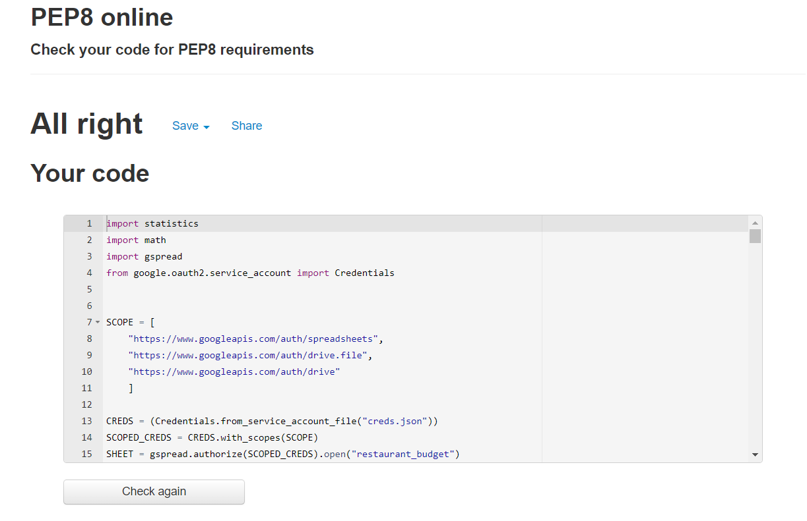

# Restaurant Management App
This website was built to give users the ability to create bookings, view the total number of bookings and calculate the number of staff required per day for a restaurant.  

This app was made as the fulfillment of the Milestone Project 3 for the Full-Stack Software Development Course provided by Code Institute. It was made using Python and deployed on Heroku using Code Institue's mock terminal.

The live website can be found [here](https://restaurant-budget.herokuapp.com/)

## Table of Contents

- [How to Use](#How-to-Use)
- [Goals](#Goals)
    - [User Goals](#User-Goals)
    - [Differences in finished site](#Differences-in-finished-site-to-initial-design)
    - [Limitations](#Limitations)
- [Features](#Features)
    - [Future Features](#Future-Features-to-Implement)
- [Technologies](#Technologies)
    - [Languages](#Languages)
    - [Tools](#Tools)
- [Testing](#Testing)
    - [Overview](#Overview)
    - [Validator Testing](#Validator-Testing)
    - [Issues/Bugs Resolved During Testing](#Issues/Bugs-Resolved-During-Testing)
    - [Testing User Stories](#Testing-User-Stories)
- [Deployment](#Deployment)
- [Credits](#Credits)
- [Acknowledgments](#Acknowledgments)

****

## How to Use

The Restaurant Management App is designed to improve efficiency, reduce errors and be an easy way for all restaurant managers to create bookings, view bookings and the minimum number of staff needed for each working day.

The user has three options upon opening the app:

1. Enter a new booking
2. View total number of bookings
3. Caluclate staff numbers required for the upcoming week

The user selects their desired option and follows the on screen instructions. Dependant on their choice they will be shown an output with their desired data.

The app is designed for all restaurant bookings to be made through the app throughout the previous week, then towards the end of the week the number of staff can be calculated so a work schedule can be produced. 

### Goals

#### User Goals

- As a user I want to be able:

    - To make a booking for a specific day inputting the number of guests required for the booking.
    - To save this booking and it to add to the total number of people booked in that day. 
    - To view the total number of people booked in on any given day in the week.
    - To be able to see how many staff are required for the number of people booked.
    - To be able to reset the bookings and start again each week.

### Structure

- A navigation bar will be on the homepage with links to each section/modal. Navbar titles will be Kick-off, Rules and League-Table. This fulfills the user stories:
    - > "I want to understand the purpose of the site and learn how to play the game."
    - > "To be able to know how to start the quiz and navigate the site immediately."
- The homepage will provide a basic hook line drawing the user in and explaining what to do. This fulfills the user story:
    - >"I want to understand the purpose of the site."
- The use of CSS and media queries will make the website responsive. The initial design will be for mobile devices and the responsive design will ensure the layout changes as the screen size increases. This fulfills the user story:
    - >"I want to be able to play the quiz on all devices"
- The quiz section will contain a question container and then a results container when the quiz is finished. This will display the score to the user. This will fulfill the user story:
    - >" To see my score when the quiz is finished."
- The results modal will contain a short form where the user can input their name and save it to the league table. The league table modal will display the top 20 high scores in order from highest to lowest. This will fulfill the user stories: 
    - >"To see my score when the quiz is finished."
    - >"To be able to play the quiz on all devices."
    - >"To find the saved League Table and try and beat the high scores."
- The rules modal will contain a list of the rules and methods to play this quiz. This fulfills user story:
    - >"To be able to know how to start the quiz and navigate the site immediately."

### Design

### Differences in finished site to initial design 
1. The "Kick-off" button is now placed in the centre of the homepage and coloured in gold. It was originally designed to be on the nav bar on the top left. However, after user feedback during the testing stage found that many users were unsure how to start the game, it was moved to be more clear and concise. 

2. The initial site was going to include a share now button to enable the user to share their score on social media and encourage others to play the quiz. This feature was not implemented as the social media accounts do not exist and to keep the quiz simple to use. 

### Limitations

- As the app is run using Code Institue's Mock Terminal it doesn't offer a particularly user friendly interface. This could be improved by adapting the terminal or creating original HTML/CSS code for the app, turing it into a Full Stack Project.  

***

## Features

### Existing Features

#### Home Page
- Header and navigation bar
    - Located at the top of the homepage it allows the user to navigate between the rules and the league table modals.
    - The design is styled on the official Arsenal FC website using the same colouring and container/box styles.
    - The JavaScript will bring up the rules and league table modals when the corresponding button is clicked.

- Hook line and Kick-off button
    - A short hook line is located just underneath the navbar, it allows the users to know what the website is about and what their first course of action should be.
    - The Kick-off button is located centrally on the page and is a bright contrasting colour making it easy to find and obvious to the new user.
    - The Kick-off button initiates the quiz, using JS when clicked, and pulls up the first question.

- Footer
    - The footer section contains my name and a link to my GitHub page so users know who the author is and where they can access other sites made by me. 
    - It also matches the header creating symmetry and improving the style of the site.
    

#### Quiz Container
The quiz container is split into two sections the question section and the answers section.
- Question Section
    - The question section is a famous arsenal image with the question overlaid on top.
    - The question is in 'bubble style' writing with a black border to allow the users to read the question.
    - Above the image is a question counter so the user knows how many questions they have answered.
    - JavaScript takes the question property from the relevant object in the questions array and places it into the inner HTML, displaying the question.

- Answers Section
    - The answers section is made up of four potential answers inside buttons.
    - The answers are generated in the same way as the question, the JD takes the answers property from the relevant object in the questions array.
    - When the user selects their answer the correct answer will highlight the button in green. If the selected answer is wrong it will highlight in red, with the correct one in green.
    - This is performed using an event listener comparing the Id of the clicked answer with the correctAnswer value in the questions array.
    - The quiz then waits 1.5 seconds before moving on to the next question to allow the user to see if they answered correctly or not.

#### Results Section
- Score and result
    - The top part of the results section displays the score and the result category. The category gives a short humourous snippet that keeps the user engaged and motivates the user to try again.
    - A for loop is run to bring up the different result categories and funny caption.
    - The bottom half of the results section allows the user to input their username and save it to the league table.
    - The save button will not be activated until a username has been typed into the input.
    - Once the save button is clicked, the JavaScript will create an object from the score and name before adding it into the high socres array. This array is then ordered, spliced and stored in local storage.
    - There is also a small nav bar with Homepage, Rematch and League-table buttons. This navbar allows the user to replay the game or navigate away from the results without saving their score.

#### League Table Modal
- The league table modal contains a table displaying the top 20 scores and their respective "league" positions. This allows the user to see their score compared to other people around them.
- The JS uses the .map() method to create a new object with using HTML and the highscores array, this is then added to the inner html of the table.
- There is also a back button that takes the user back to the homepage.

#### Rules Modal
- The rules modal contains a list of rules and methods on how to play the quiz.
- It is styled the same as the league-table modal and also includes the back button.

### Future Features to Implement
- The ability to input a time of booking, not just day and number of people, would allow the user to have greater knowledge on when tables are booked.
- In addition each day could be split into three "services", breakfast, lunch and dinner. The app could then be updated to calculate staff required for each service for each day, providing a more realistic overview of how a restaurant needs to schedule it's staff. 
- Another feature to be added in the future is the ability to make bookings further in the future than the current week. This could be done by using a date function, or a week commencing function.
- Tieing into this the ability to view historical data/bookings/staff numbers without going to the Google Sheets would be useful to improve budgetting ability.
- The four features above, are one step in the road into developing this app into a full business management/CRM style app. This is where I envision this app developing in the future. 

***

## Technologies

- Languages
    - The project was written using Python 3.8.11
    -  The following modules and APIs were installed to improve the output and functionality:
        - Math - Used for the ceil() function to round numbers up to the nearest integer
        - Statistics - Used for the fmean() function to calculate the mean average and reduce the amount of code needed
        - Gspread - API for Google Sheets used to get and update the worksheet 
        - Google Auth - Authenticates Google's APIs and takes the credentials from the Google Sheets 

- Tools    
    - Gitpod was used as an online IDE
    - Github was used as the repository for the source code
    - Herkou was used as the platform to run the deployed app
    - Google Sheets was used to store the data and where the initial "historical data" was held
    - Code Institute's Python Essentials Template was used to view the app in a mock terminal
    - PEP8 checker was used to check the Python code for errors 

***

## Testing

### Overview

Testing will be performed on the functionality of the app. The ease of use and clarity will also be reviewed to ensure the back-end code integrates nicely with the front-end design. 

Testing will look for the following:

- The interaction and statements printed to the terminal are clear and easy to follow.
- All inputs are checked and validated to ensure the user does not input invalid data type. Errors will be raised and an opportunity to try again will be allowed following invalid data entry.
- No unexpected errors occur once deployed to Herkou and all errors raised are due to user input error.
- The user is given the option to return to the main menu upon finishing their action for ease of use/
- All bookings made by the user are saved to the Google Sheet and then can be pulled up prior to calculating staff numbers.

### Validator Testing

- Python
    - The official PEP8 online syntax checker came back with no issues. 

     

### Issues/Bugs resolved during testing 

- Upon deployment the dictionary showing the current weeks bookings that was printed to the terminal was difficult to read and spread over across two lines. This was resolved by installing the pprint() function to make it clearer in the terminal with each new key:value pairing print on a new line.

- The fix above then created a new bug. In Python 3.8 + the print() function orders dictionaries in order of creation of key:value pairs. However, pprint() orders them alphabectially by key. This was solved by adding "sort_dicts=False" inside each pprint function.

- If the user selected "Y" to return to the main menu within function "restart()" and then selected "N" to end the app once "restart()" is run a second time, two identical print statements were returned in the format:
     > "Thank you for using the restaurant management app.
Thank you for using the restaurant management app"

    This was fixed by creating a new function "main_menu()" which only runs the "start()" function if the variable is True.

- I originally had the inputs accepting those starting both with and without a capital letter (e.g. Monday or monday). This made for a large number of if statements within my try statements. I didn't wish to remove the ability to use lower case as it takes away from the user friendliness of the app. To fix this I added the .capitalize() method to the end of all my input() functions, automatically Capitalizing the input, making them valid (provided the input is of the correct type) 
### Testing User Stories

***

## Deployment 

The project is hosted by Heroku using Code Institute's Python Essentials Mock Terminal:

### Deploy to Heroku

Please deploy the app to Heroku using the following steps:

1. Log into Heroku and click the 'New' button and then "Create new app" from the drop down list
2. Name your app (it must be unique) and select the region you are based in
3. Select settings and scroll down to the config vars section
4. Within config vars enter CREDS into the key field and the contents of your creds.json file into the value field. This allows Herkou to have access to your Google Sheets.
5. Add another config var of PORT (key) 8000 (value) to ensure the mock terminal works.
6. Select the buildpack button and add two buildpacks of Python and NodeJS in that order
7. In the connect to Github section, add the repository name to link the Github.
8. Press deploy to deploy the app to Heroku, you can also opt in to "Enable Automatic Deploys" which updates the Heroku everytime a new change is pushed to Github.

### Fork the GitHub

If you wish to view or make changes without affecting the original repository you can 'fork the repository'. This creates a copy to your GitHub and can be done using the following steps:

1. Log in to Github and locate the [Restaurant Budget Repository](https://github.com/tdawes93/restaurant-budget)
2. At the top right of the repository underneath the notification icon is the 'fork' button
3. Click this button and you should now have a copy of the repository in your Github account

### Make a local clone

1. Log in to Github and locate the [Restaurant Budget Repository](https://github.com/tdawes93/restaurant-budget)
2. At the top of the repository next to the 'Gitpod' button click the dropdown named 'Code'
3. To clone the repository using HTTPS, make sure HTTPS is selected and copy the link
4. Open the Git Bash
5. Change the working directory to the location you wish the clone to be made
6. Type 'git clone' and paste the copied URL
7. Press 'Enter' and your local clone will be created

### Using repository with own historical data

Please be aware that if you wish to use this repository for your own business or with your own historical data, you must use the following steps in addition to above:

1. Create a Google Sheets using the same format as shown in the features section. It must have four worksheets and seven columns, all with the same names/labels as shown 
2. In Google Cloud Platform, create a project and link the Google Sheets using the Google Drive and Google Sheets APIs
3. Save the downloaded "credentials file" and upload it into your Gitpod in a cred.json file (this is the contents you need in the deployment section)
4. You can now continue to deployment. 

***

## Credits
- Inspiration
    - The idea for this app along with suggested future updates was borne from countless weeks having to estimate takings and staff numbers required whilst managing pubs

- Code
    - The update_worksheet function was take from Code Institute's Love Sandwiches Mini Project

***

## Acknowledgments

I'd like to thank my mentor Spencer Bariball for his support and feedback throughout the project. I'd also like to thank the group of friends and family I had test and give feedback on the site on their various mobiles and laptops.